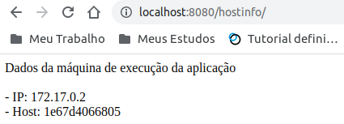
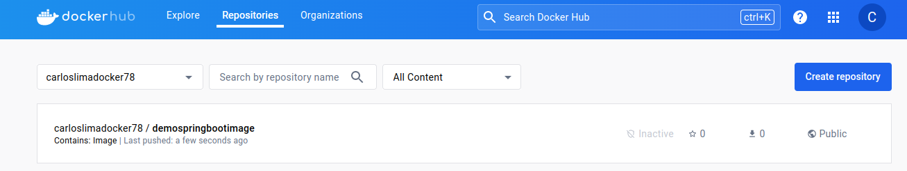

# Docker

Docker é uma plataforma de código aberto que permite empacotar, distribuir e executar aplicativos em ambientes isolados chamados contêineres. Esses contêineres encapsulam o código, bibliotecas e dependências, garantindo consistência entre diferentes ambientes, desde o desenvolvimento até a produção. 

Ao proporcionar uma solução padronizada para o empacotamento de aplicativos, o Docker simplifica significativamente o processo de implantação, escalabilidade e gerenciamento de aplicações em diversos cenários, tornando-se uma ferramenta essencial na era da computação em nuvem e cultura DevOps.

- **Docker** é a empresa que criou o **Docker Engine**.
- Conteiners existem a bastante tempo no Linux, o Docker apenas disponibiliza um ferramental para interagir com os conteiners.
- Embora seja possível a execução de containers em ambientes Windows, Linux e Mac, em ambiente Linux sempre será mais performático, pois containers são naturalmente Linux.

## Sobre o Mão na Massa ...

As abordagens pŕaticas a seguir, utilizarão os itens presentes na estrutura da aplicação de demonstração em *Spring Boot* presente neste repositório (https://github.com/carloslima78/devops-trilhas/tree/main/spring-boot-app) como aplicação, Maven, imagem Docker, arquivos Dockerfile e Docker Compose, etc.

Na documentação do repositório são explicados os pré requisitos para uma aplicação Java Spring Boot ser executada a partir de imagens Docker.

## Conteiner

Trata-se da execução do recurso provisionado a partir de uma imagem.

## Imagem

Trata-se do artefato contendo os componentes necessários para execução de um conteiner.

**Observação**: Sobre imagem e conteiner podemos fazer um paralelo com a orientação a objetos, onde a imagem é a classe e o conteiner é o objeto instanciado a partir da classe, ou seja, um conteiner é lançado a partir de uma imagem.

## Virtualização vs Conteinirização

- **Virtualização**: Tem como base máquinas virtuais sendo que cada uma com um sistema operacional instalado.

- **Conteinirização**: Processos isolados executdos em um sistema operacional.

## Instalação do Docker

Passos para instalação do Docker no ambiente Linux Ubuntu:

- Comando de instalação:

```hcl

sudo apt install docker-ce

```

- Comando para verificar o status da instalação:

```hcl

sudo systemctl status docker

```

## Comandos Básicos do Docker

Criação do clássico e acadêmico container **Hello World**, é executado baseado na imagem *hello-world*, e sua funcialiade é imprimir as instruções de utilização do Docker e logo em seguida é encerrado:

- Comando para lançar o container **Hello World**: 


```hcl

docker container run hello-world

```

- Lançando o container Hello World nomeando-o:

```hcl

docker container run --name meucontainer hello-world

```

- Comando para listar apenas os conteiners que estão em execução:

```hcl

docker container ls

```

- Comando para listar todos os conteiners tanto em execução quanto os encerrados:

```hcl

docker container ls -a

```

- Comando para remover um conteiner em execução pelo nome do container ou nome da imagem:

```hcl

docker container rm nomedocontainer

```

- Comando para listar os logs de um container:

```hcl

docker logs nomedocontainer

```

- Comandos para parar e remover um container:

```hcl

docker container stop nomedocontainer

docker container rm nomedocontainer

```

- Comando para remover um container sem a necessidade de pará-los antes:

```hcl

docker container rm -f nomedocontainer

```

- Comando para remover todos os containers em execução de uma só vez via sub comando:

```hcl

docker container rm -f $(docker container ls -a q)

```

### Modo Interativo

Trata-se da execução de um container acessando o seu terminal de forma que seja possível realizar outras operações como em um sistema operacional.

#### Container Ubuntu

- Lançando um container *Ubuntu* acessando seu terminal via bash:

```hcl

docker container run -it ubuntu /bin/bash

```

Após a execução do container *Ubuntu* no modo interativo, será possível realizar instalações como *apt get update && apt install curl* como sendo um sistema operacional.

```hcl

apt update

install curl

curl https://www.google.com.br

sudo docker container run -it ubuntu /bin/bash

```

O comando "exit" sai do modo interativo do conteiner:

```hcl

exit

```

### Port Bind

Trata-se do recurso que permite associar a porta de um container com a porta da máquina local, permitindo acesso externo ao container.

- Comando para associar a porta 8080 da máquina local com a porta 80 do container NGINX, permitindo acesso via navegador:

```hcl

docker container run -d -p 8080:80 nginx

```

#### Container NGINX

- Lançando um container *nginx* 

```hcl

docker container run nginx

```

Após a execução do container *nginx*, o terminal seguirá travado pelo fato de que o nginx é um servidor de execução contínua.

Para evitar o travamento do terminal conforme citado acima, será necessário executar o container em modo *backgound (Deamon)* conforme comnado abaixo:

```hcl

docker container run -d -p 8080:80 nginx

```

- Comando para operar um container nginx já em execução em modo interativo:

```hcl

docker container exec -it nomedocontainer /bin/bash

```

Após a execução do container nginx em modo interativo, executando o comando **curl localhost/80** será apresentada o *HTML* da página inicial do NGINX.

### Variáveis de Ambiente

Tratam-se de configurações que podem ser definidas e acessados ​​durante a execução de contêineres para configurar aplicativos ou definir comportamentos específicos, como senhas de banco de dados ou informações de configuração.

- Essas configurações ficam disponíveis na documentação da imagem no Docker Registry *(Docker Hub, AWS ECR, etc.)**.
- O argumento para definir variáveis de ambiente é o **-e**.

#### Container Postgres

- Será um container baseado na imagem **postgres**.
- Faremos o mapeamento *(Port Bind)* da porta padrão do Postgres **5432**.
- **Sugestão**: Instalar o **DBeaver** ou algum outro client para geranciar o banco de dados.


```hcl

docker container run -d -p 5432:5432 -e POSTGRES_DB=nome-do-BD -e POSTGRES_USER=admin -e POSTGRES_PASSWORD=1234 postgres

```

## Contruindo uma Imagem Docker

Processo de contrução de imagens Docker para que posteriormente possam ser lançadas como conteiners.

### Dockerfile

Trata-se do arquivo que contém os passos para a contrução de uma imagem Docker.

**Importante:** 
- Toda imagem é construída baseada em uma imagem base.
- Por convenção, o arquivo deve ser nomeado como **Dockerfile**.
- Cada comando executado, será uma camada na estrutura da imagem Docker.
- O container é uma camada superior a imagem que utiliza sua referencia para ser executado.

- Arquivo Dockerfile para contrução de uma imagem de uma aplicação Java:

```hcl
# Define a imagem base a ser usada, neste caso, uma imagem OpenJDK versão 17 slim.
FROM openjdk:17-jdk-slim

# Copia o arquivo JAR construído durante a compilação para o sistema de arquivos do contêiner.
COPY target/demo-0.0.1-SNAPSHOT.jar demo-0.0.1-SNAPSHOT.jar

# Define o comando que será executado quando o contêiner for iniciado.
ENTRYPOINT ["java", "-jar", "/demo-0.0.1-SNAPSHOT.jar"]
```

### Instruções do Dockerfile

| Instrução | Objetivo | 
| ---- | ----- | 
| FROM | Iniciliza a construção de uma imagem Docker a partir de uma imagem base. | 
| WORKDIR | Define o diretório corrente. |
| RUN | Executa um comando. |
| LABEL | Adiciona metadados na imagem. |
| EXPOSE | Define a porta que o container vai expor. |
| ENV | Define variáveis de ambiente. |
| COPY | Copia arquivos ou diretórios e adiciona ao sistema de arquivos da imagem. |
| ADD | Copia arquivos ou diretórios remotos e adiciona ao sistema de arquivos da imagem. |
| CMD | Define o comando e/ou parâmetros padrão. |
| ARG | Define um argumento para ser utilizado no processo de construção. |
| ENTRYPOINT | Configura um container para que opere como um executável. |
| VOLUME | Define volumes para o conteiner. |

### Docker Ignore

Trata-se do arquivo que aponta o conteúdo que não deve ser considerado para a contrução de uma imagem Docker. 

**Importante:** 
- Por convenção, o arquivo deve ser nomeado como **.dockerignore**.
- Conceito similar ao *.gitignore*.

### Docker Build

Trata-se do comando Docker para construção de uma imagem Docker baseando-se no arquivo Dockerfile.

**Importante:** 
- O comando *docker build* deve ser executando no mesmo contexto do arquivo Dockerfile, ou seja, no mesmo diretório.

- Comando para construção de uma imagem Docker:

```hcl
docker build -t demospringbootimage .
```

- Comando para listar as imagens:

```hcl
docker image ls

REPOSITORY                                 TAG                   IMAGE ID       CREATED         SIZE
demospringbootimage                        latest                6e34c8ab44aa   8 seconds ago   427MB
```

- Comando para executar o container realizando um Port Bind para a porta 8080

```hcl
docker container run -p 8080:8080 -d --name demospringboot demospringbootimage
```

- Comando para listar os containers em execução. O container *demospring* deve ser listado:

```hcl
docker container ps

CONTAINER ID   IMAGE                 COMMAND                  CREATED          STATUS          PORTS                                       NAMES
980662d029c8   demospringbootimage   "java -jar /demo-0.0…"   22 seconds ago   Up 20 seconds   0.0.0.0:8080->8080/tcp, :::8080->8080/tcp   demospringboot
```

- Ao requisitar *http://localhost:8080/hostinfo/* a aplicação será executada no container:





- Comando para parar o container demospringboot

```hcl
docker container stop demospringboot
```

- Comando para remover o container demospringboot

```hcl
docker container rm demospringboot
```

- Comando para remover a imagem demospringbootimage

```hcl
docker container stop demospringboot
```

## Docker Compose

Docker Compose permite executar ambientes de aplicativos com vários contêineres com base nas definições definidas em um arquivo YAML.

### Instalação do Docker Compose

Passos para instalação do Docker Compose no ambiente Linux Ubuntu:

- Comando para donwload do executável em **/usr/local/bin/docker-compose**, tornando-o acessível de forma global na máquina local como **docker-compose**:

```hcl
sudo curl -L "https://github.com/docker/compose/releases/download/1.29.2/docker-compose-$(uname -s)-$(uname -m)" -o /usr/local/bin/docker-compose
```

- Comando para definir as permissões para que o **docker-compose** seja executável:

```hcl
sudo chmod +x /usr/local/bin/docker-compose
```

- Comando para verificar se a instalação do **docker-compose** foi bem sucedida:

```hcl
docker-compose -version

docker-compose version 1.29.2, build 5becea4c
```

### Contruindo uma Imagem Docker e Iniciando um Container

O processo de contrução da imagem Docker e execução do container, será por meio do arquivo docker-compose. A definição da imagem será baseada no arquivo Dockerfile.

O arquivo docker-compose.yml abaixo define um serviço chamado demdemospringboot. 

O contêiner para esse serviço será chamado demospringboot e será construído a partir do arquivo Dockerfile localizado no diretório atual. 

A imagem resultante terá o apelido demospringbootimage:latest. A porta 8080 do host será mapeada para a porta 8080 do contêiner.

Em resumo, este arquivo docker-compose define um serviço que irá executar um contêiner que pode ser acessado na porta 8080 do host.

Aqui está uma explicação mais detalhada de cada linha do arquivo:

- **services**: Esta linha define a seção services do arquivo docker-compose.yml. Esta seção contém a definição dos serviços que serão criados.

- **demospringboot**: Esta linha define um serviço chamado demospringboot.

- **container_name**: demospringboot: Esta linha define o nome do contêiner para o serviço demospringboot.

- **build**: Esta linha define a configuração da construção da imagem para o serviço demospringboot.

- **context**: Esta linha define o contexto do build como o diretório atual.

- **dockerfile**: Dockerfile: Esta linha especifica o arquivo Dockerfile a ser utilizado para construir a imagem.

- **image**: demospringbootimage:latest: Esta linha atribui um apelido para a imagem resultante do build.

- **ports**: Esta linha mapeia as portas do host para as portas do contêiner. No caso deste exemplo, a porta 8080 do host é mapeada para a porta 8080 do contêiner.


```hcl
# Versão da sintaxe do Docker Compose que está sendo usada.
version: '3'

# Configuração dos serviços Docker.
services:
  # Configuração do serviço chamado 'demospringboot'.
  demospringboot:
    # Define o nome do contêiner como 'demospringboot'.
    container_name: demospringboot

    # Configuração da construção da imagem.
    build:
      # Define o contexto do build como o diretório atual (onde está localizado o docker-compose.yml).
      context: .

      # Especifica o arquivo Dockerfile a ser utilizado.
      dockerfile: Dockerfile

    # Atribui um apelido para referenciar a imagem
    image: demospringbootimage:latest

    # Mapeia a porta 8080 do host para a porta 8080 do contêiner.
    ports:
      - "8080:8080"
```

O comando para gerar a imagem e subir o container via compose é:

```hcl
docker-compose up
```

Este comando executará os seguintes passos:

1. Construir as imagens dos serviços definidos no arquivo docker-compose.yml.

2. Iniciar os contêineres para os serviços definidos no arquivo docker-compose.yml.

O comando docker-compose up irá gerar a imagem demospringbootimage:latest e iniciar o contêiner demospringboot. O contêiner demospringboot estará acessível na porta 8080 do host.

Para gerar apenas a imagem, você pode usar o seguinte comando:

```hcl
docker-compose build
```

Este comando irá construir as imagens dos serviços definidos no arquivo docker-compose.yml, mas não  iniciará os contêineres.

Para iniciar apenas os contêineres, pode-se usar o seguinte comando:

```hcl
docker-compose up -d
```

Este comando iniciará os contêineres para os serviços definidos no arquivo docker-compose.yml, mas não construirá as imagens.


## Dockerfile vs Docker Compose

Dockerfile e Docker Compose são duas ferramentas importantes para o desenvolvimento e implantação de aplicações Docker.

**Dockerfile** é um arquivo de texto que descreve como construir uma imagem Docker. Uma imagem Docker é um pacote de software que contém tudo o que é necessário para executar uma aplicação em um contêiner Docker.

Usado para construir imagens Docker, enquanto Docker Compose é usado para executar aplicações Docker.

O arquivo Docker Compose abaixo provisiona um container para o servidor Redis e outro para o Redis Insight:

**Docker Compose** é uma ferramenta que permite definir e executar aplicações multi-contêiner. Uma aplicação multi-contêiner é uma aplicação que é composta de vários contêineres que trabalham juntos.

Dockerfile é um arquivo de texto simples, enquanto Docker Compose é um arquivo YAML mais complexo.


## Docker Registry

Trata-se do repositório de imagens Docker. Seu objetivo é disponibilizar imagens Docker em um ambiente comum e assim otimizar o trabalho de equipes de desenvolvimento permitindo a distribuição dessas imagens. 

Existem diversas opções de Registry no mercado:

- Docker Hub.
- AWS Elastic Container Registry.
- Azure Container Registry.
- Google Container Registry.

### Docker Hub

É o principal repositório de imagens Docker do mercado (hub.docker.com). Permite a publicação de repositórios públicos e privados.

### Convenção de Nomes para Imagens

Para publicação de imagens *não oficiais* no Docker Hub, é necessário seguir uma nomencaltura de nomes:

**Exemplo:** *namespace/repositorio:tag* -> *carloslimadocker78/nome-da-imagem:v1*
**Observações:** 
- O namespace nada mais é que o nome da sua conta no Docker Hub.
- Imagens oficiais não usam Namespace, ex: *ubuntu:22.04*

Passo a passo para publicar uma imagem no Docker Hub:

- Construa a imagem:

```hcl
docker build -t demospringbootimage .
```

- Faça o tageamento da imagem *(Não obrigatório, mas é uma boa prática.)*

```hcl
docker tag demospringbootimage carloslimadocker78/demospringbootimage:v1
```

- Comando para tagear a imagem *latest* para que seja a última versão no repositório:

```hcl
docker tag demospringbootimage carloslimadocker78/demospringbootimage:latest
```

- Login na conta do Docker Hub *(Entrar com Username e Password da conta)*

```hcl
docker login
```

- Comando para publicar a imagem com a tag v1:

```hcl
docker push carloslimadocker78/demospringbootimage:v1
```

- Comando para publicar a imagem com a tag latest:

```hcl
docker push carloslimadocker78/demospringbootimage:latest
```

- A imagem estará publicada no DockerHub e disponível para execução de containeres.



- Execute o container basedo na imagem publicada no Docker Hub:

```hcl
docker container run -d --name  demospringboot -p 8080:8080 carloslimadocker78/demospringbootimage:latest
```

- Ao requisitar *http://localhost:8080/hostinfo/* a aplicação será executada no container a partir da imagem criada no DockerHub:

