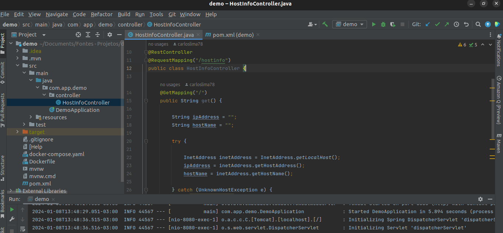
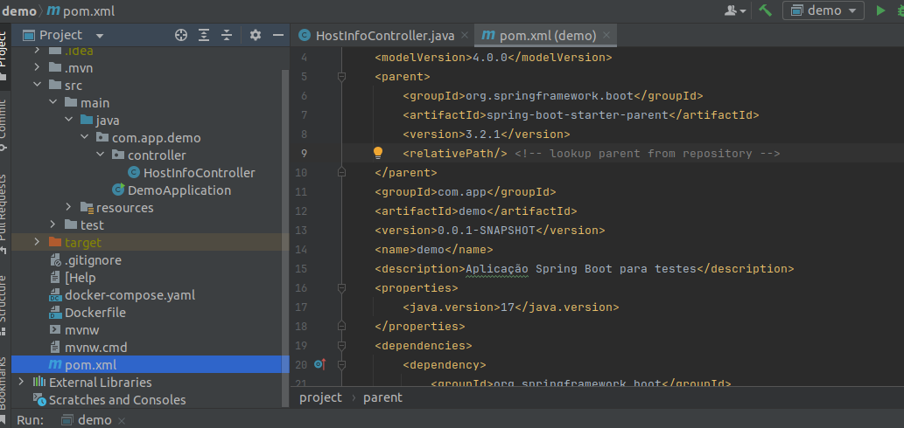
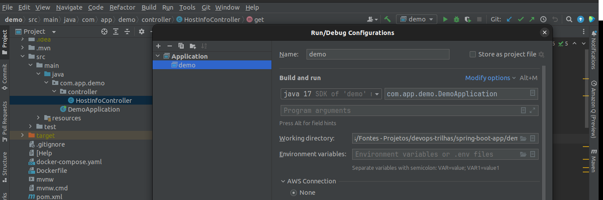

# Aplicação Demonstrativa Java e Spring Boot 

Esta aplicação foi desenvolvida com o objetivo de fornecer um ambiente de teste para explorar as práticas DevOps, incluindo o uso de tecnologias como Docker, Kubernetes, entre outras. 

O código fonte está escrito em **Java**, e a aplicação foi projetada para ser facilmente implantada e escalada em ambientes de contêiner.

## Descrição

Trata-se de um exemplo de um controlador REST API com **Spring Boot**, que a princípio expõe informações sobre o host em que a aplicação está sendo executada. Aqui estão alguns pontos-chave:

1. **@RestController** e **@RequestMapping("/hostinfo")**: Essas anotações do Spring Boot indicam que esta classe é um controlador REST e que as solicitações para /hostinfo serão manipuladas por este controlador.

2. **@GetMapping("/")**: Esta anotação mapeia o método get() para lidar com solicitações HTTP GET para o caminho /hostinfo/.

3. **Método get()**: Este método obtém o endereço IP e o nome do host da máquina de execução usando InetAddress. Em caso de exceção (UnknownHostException), uma pilha de rastreamento é impressa.

4. StringBuilder para construir a resposta: O método constrói uma mensagem contendo informações sobre o endereço IP e o nome do host da máquina de execução.

5. Retorno como String: A mensagem construída é retornada como uma String. Geralmente, isso seria convertido automaticamente para JSON quando consumido por um cliente que aceita JSON.

A aplicação retorna informações sobre a máquina de execução da aplicação quando uma solicitação GET é feita para /hostinfo/. Essa funcionalidade pode ser útil em um ambiente DevOps para verificar rapidamente as propriedades da máquina onde a aplicação está sendo executada.

## Pré Requisitos

Neste cenário estamos utilizando o sistema operacional **Ubuntu 20.04**.

- Comando para verificar a versão do Ubuntu:

```hcl
lsb_release -a

No LSB modules are available.
Distributor ID:	Ubuntu
Description:	Ubuntu 22.04.3 LTS
Release:	22.04
Codename:	jammy
```

1. Embora seja página virada para muitos, vale ressaltar que será necessária uma IDE de desenvolvimento, neste caso foi utilizado o **InteliJJ Community Edition**, mas temos outras boas IDEs como o Spring Tool Suite, o Eclipse, VS Code, etc.



2. Garanta que o Java JDK está instalado e a versão é compatível com o projeto que está iniciando, neste cenário trata-se do **Java 17**.

- Comando para verificar a versão do Java instalado.

```hcl
java --version

openjdk 17.0.9 2023-10-17
OpenJDK Runtime Environment (build 17.0.9+9-Ubuntu-122.04)
OpenJDK 64-Bit Server VM (build 17.0.9+9-Ubuntu-122.04, mixed mode, sharing)

```

- Comandos para caso tenha uma versão anterior a 17 do Java ou não tenha o Java instalado.

```hcl
sudo apt update
```

```hcl
sudo apt install -y openjdk-17-jdk
```

```hcl
java --version

openjdk 17.0.9 2023-10-17
OpenJDK Runtime Environment (build 17.0.9+9-Ubuntu-122.04)
OpenJDK 64-Bit Server VM (build 17.0.9+9-Ubuntu-122.04, mixed mode, sharing)

```

- Arquivo **pom.xml** tageando a versão 17 do Java.

```hcl
	<properties>
		<java.version>17</java.version>
	</properties>
```




- Configurações de debug da aplicação.




- Estrutura do projeto.


3. Garanta que o **Maven** esteja instalado e apontando para a versão correta do Java, neste caso o 17.

- Comando para verificar a versão do Maven. Neste caso, nota-se que o Maven está apontando para a versão correta do Java, a 17, conforme a linha *Java version: 17.0.9, vendor: Private Build, runtime: /usr/lib/jvm/java-17-openjdk-amd64*. 

**Caso o Maven não estivesse apontando para a versão correta do Java, seria necessário editar a variável de ambiente**.

```hcl
mvn -version

Apache Maven 3.9.6 (bc0240f3c744dd6b6ec2920b3cd08dcc295161ae)
Maven home: /opt/apache-maven-3.9.6
Java version: 17.0.9, vendor: Private Build, runtime: /usr/lib/jvm/java-17-openjdk-amd64
Default locale: pt_BR, platform encoding: UTF-8
OS name: "linux", version: "6.2.0-39-generic", arch: "amd64", family: "unix"
```

- Comando para imprimir o valor da variável de ambiente **JAVA_HOME**. Neste caso, nota-se que está coma versão correta do Java, a 17.

```hcl
echo $JAVA_HOME
```

- Caso precise atualizar a versão do Maven, remova a versão anterior com o comando abaixo. Isso excluirá a configuração do Maven, os arquivos de dados e suas dependências

```hcl
sudo apt autoremove --purge maven
```

- Encontrar a versão mais recente – ela está disponível na página Downloading Apache Maven (https://maven.apache.org/download.cgi).


- Download dos binários no arquivo baixado **tar.gz** o seguinte comando:

```hcl
wget https://dlcdn.apache.org/maven/maven-3/3.8.4/binaries/apache-maven-3.8.4-bin.tar.gz
```

- Extraindo os arquivos para a pasta **/opt**.

```hcl
tar xf apache-maven-3.8.4-bin.tar.gz -C /opt
```

Abaixo está uma breve descrição das opções usadas com o comando tar :

x: extraia o arquivo fornecido de um arquivo (modo de operação);
f: use arquivo compactado (seleção de dispositivo);
C /opt: mova para o diretório /opt antes de realizar qualquer operação (seleção de arquivo local).

- Verifique a versão do Maven.

```hcl
mvn -version

Apache Maven 3.9.6 (bc0240f3c744dd6b6ec2920b3cd08dcc295161ae)
Maven home: /opt/apache-maven-3.9.6
Java version: 17.0.9, vendor: Private Build, runtime: /usr/lib/jvm/java-17-openjdk-amd64
Default locale: pt_BR, platform encoding: UTF-8
OS name: "linux", version: "6.2.0-39-generic", arch: "amd64", family: "unix"
```

fonte: (https://keepgrowing.in/java/how-to-fix-error-executing-maven-issue-after-updating-to-java-17/)


## Gerando o arquivo executável .Jar

1. Compilar o projeto. :

```hcl
mvn compile
```

Este comando compila o código-fonte do projeto, gerando os arquivos compilados na pasta target.

2. Executa os testes no projeto.

```hcl
mvn test
```

3. Gera o arquivo JAR do projeto na pasta target, que pode ser executado ou distribuído.

```hcl
mvn package
```
Este comando compila o código-fonte, executa testes, gera o artefato (por exemplo, um JAR) e o coloca no diretório target.

No entanto, o artefato gerado não é instalado no repositório local do Maven. Isso significa que não está disponível para outros projetos Maven no mesmo ambiente.

```hcl
mvn clean install
```

Este comando realiza uma limpeza do projeto removendo os artefatos compilados e constrói o projeto do zero.

O objetivo install não apenas gera o artefato (geralmente um JAR) como o comando package, mas também o instala no repositório local do Maven, tornando-o disponível para outros projetos no mesmo ambiente de desenvolvimento.

4. Executa a aplicação iniciando-a a partir do arquivo JAR gerado nos passos anteriores.

```hcl
java -jar target/seu-arquivo.jar
```
5. Interromper a execução da aplicação.

**Ctrl + C (Interromper no Terminal)**: No terminal onde a aplicação foi iniciada, pressionar Ctrl + C interromperá a execução da aplicação.

## Dica: Como encerrar um processo em execução escutando uma porta específica no Linux

Os comandos abaixo são usados para identificar e encerrar processos que estão utilizando a determinadas portas no Linux.

- Comando para listar qualquer processo escutando a *porta 8080 (Poderia ser outra porta)* por exemplo. Este comando utiliza o utilitário **lsof** para listar processos que estão utilizando a porta 8080.

```hcl
lsof -i:8080
```

- Comando para encerrar qualquer processo que esteja escutando a porta 8080. Este comando encerra o processo que está escutando a porta 8080 utilizando o PID obtido pelo comando lsof.

```hcl
kill $(lsof -t -i:8080)
```

- Sendo um pouco mais agressivo, este comando encerra o processo de forma mais abrupta (-9 força o encerramento) na porta 8080, útil quando o método padrão não funciona.

```hcl
kill -9 $(lsof -t -i:8080)
```

## Conclusão

Após a conclusão bem-sucedida dos passos utilizando o Maven, a aplicação Java encontra-se pronta para ser implementada em ambientes de contêineres, como Docker e Kubernetes. 

O processo de construção do JAR através do Maven proporciona uma artefato independente que encapsula a aplicação e suas dependências. 

Esse JAR pode ser facilmente incorporado em uma imagem Docker, facilitando a criação de contêineres isolados e portáteis. Ao empacotar a aplicação dessa maneira, torna-se simples a implantação e escalabilidade em clusters orquestrados por Kubernetes, onde imagens contendo o JAR podem ser gerenciadas eficientemente. 

A abordagem centrada em contêineres proporciona uma solução ágil e consistente para a distribuição e execução da aplicação em ambientes DevOps modernos.